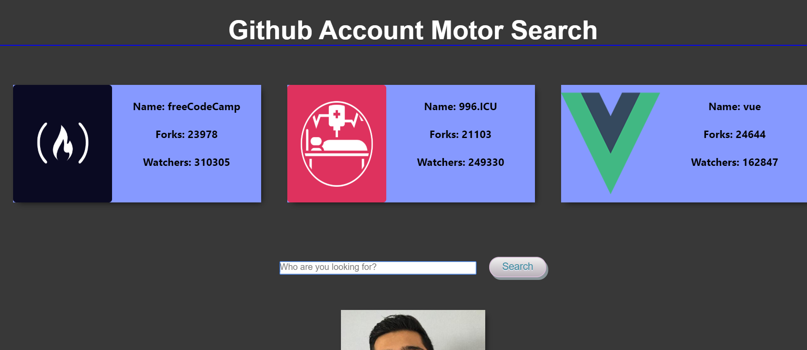
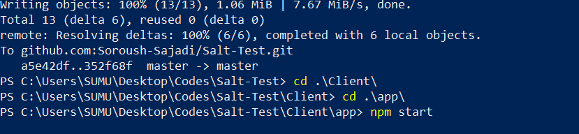
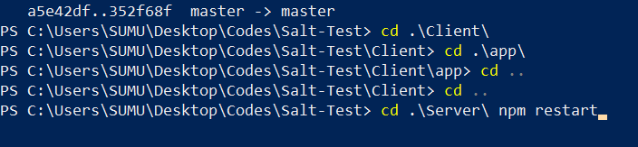

#Github Account Motor Searcher

This web app tries to help user to search accounts in github. On the top of the page exists three cards which shows the accounts with highest stars. 
There is a seach input and by typing a valid account username we will get information about all the projects have been done. 

Finally you are able to reach information about followers and following 
  
How to run the code?  
After cloning the project, you need to use the command npm install in both server and client/app. When the install for both client/app and server finished you need use command npm start in client/app and npm restart in server.
  

Tech stack: 
React 
Nodejs 
Express 
css 
API
